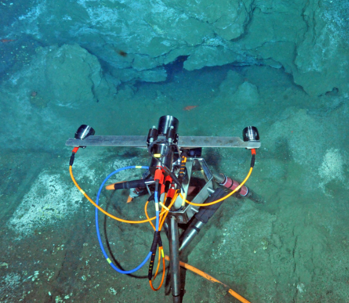
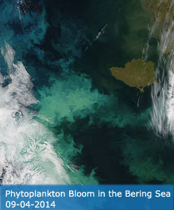
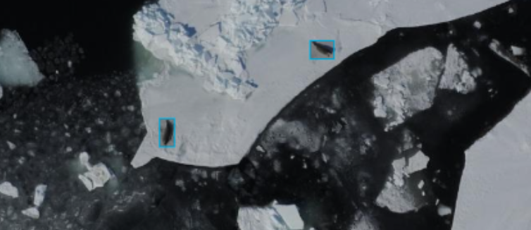

# Lesson 1: Introduction to Ocean Image Data

## Overview

In this lesson, we will explore **marine photographic and videographic data**. We will also discuss the tools used to capture these images and videos, such as **underwater cameras**, **drones**, and **satellite imagery**. Understanding this data is the first step toward applying **Computer Vision** (CV) techniques to oceanographic research.

### Learning Objectives

By the end of this lesson, you will:
- Understand the different types of ocean image data.
- Identify the tools and techniques used to capture marine imagery.
- Learn how CV can be applied to oceanographic research.

---

## Types of Ocean Image Data

Ocean image data can be broadly categorized into the following types:

### 1. **Underwater Imagery**

Underwater imagery can be captured using various types of technology, including **ROVs** (Remotely Operated Vehicles), **AUVs** (Autonomous Underwater Vehicles), and **fixed underwater cameras**.

#### **ROVs (Remotely Operated Vehicles)**

ROVs are uncrewed submersibles controlled from the surface, allowing researchers to navigate underwater in real-time. Examples include **Jason** and **ROPOS**.

- **Jason**: Operated by the Woods Hole Oceanographic Institution (WHOI), Jason is capable of deep-sea exploration, down to 6,500 meters. It is equipped with high-definition video cameras, lights, and a robotic arm for collecting samples.
  
- **ROPOS**: A Canadian ROV used for a wide range of oceanographic research, capable of working at depths of up to 5,000 meters. ROPOS is well-known for its ability to operate in harsh environments like hydrothermal vent systems.

**Advantages of ROVs**:
- **Real-time control**: The operator can see and control the ROV, making it ideal for collecting targeted samples or exploring specific areas.
- **Depth capabilities**: Some ROVs can reach extreme depths, beyond the limits of human divers.

**Drawbacks of ROVs**:
- **Cost**: ROVs are expensive to build, maintain, and operate.
- **Mobility**: While they are versatile, ROVs are tethered to a support vessel, limiting their range compared to autonomous systems.

#### **AUVs (Autonomous Underwater Vehicles)**

Unlike ROVs, AUVs are completely autonomous. They can be programmed to follow pre-determined missions and collect data without human intervention. A prominent example is **Sentry**, an AUV designed and operated by WHOI.

- **Sentry**: Capable of diving to depths of 6,000 meters, Sentry is used to map the seafloor and gather high-resolution sonar, photographic, and environmental data. AUVs like Sentry are equipped with both still and video cameras, and they can cover vast areas autonomously.

**Advantages of AUVs**:
- **Autonomy**: AUVs can operate independently for long periods, making them ideal for covering large areas.
- **Efficiency**: Without the need for a tether, AUVs can move quickly and efficiently through the water.
- **Data collection**: AUVs can be fitted with a wide range of sensors in addition to cameras, providing comprehensive environmental data.

**Drawbacks of AUVs**:
- **No real-time control**: Once launched, the operator has no control over the vehicle, meaning they cannot respond to unexpected situations.
- **Limited power**: The battery life of an AUV limits its operational time, especially for deep dives.

#### **Fixed Underwater Cameras**

Fixed underwater cameras are cabled or moored to a stationary point, typically on the seafloor, and are designed for long-term monitoring of specific locations. These cameras can provide both still images and video footage. 

An example is the **Ocean Observatories Initiative's Regional Cabled Array**, operated by the University of Washington, which streams live footage from the ocean floor.

- **Digital Still Cameras**: These cameras are often used for scientific monitoring because they produce high-quality, detailed images. They are effective in applications where still frames are sufficient for analysis. Oftentimes, these cameras can provide timeseries of a single area producing high quality ecological datasets.

- **Video Cameras**: Video cameras provide continuous monitoring and are crucial for studying dynamic processes, such as animal behavior or environmental changes over time.

**Advantages of Fixed Cameras**:
- **Long-term monitoring**: Fixed cameras are ideal for observing a location over a long period, capturing important temporal data.
- **High-quality imagery**: Both digital still and video cameras can provide high-definition images that are vital for detailed analysis.
  
**Drawbacks of Fixed Cameras**:
- **Limited range**: Fixed cameras are stationary, which means they only cover a small area.
- **Maintenance**: Maintaining these systems over long periods, especially in harsh underwater environments, can be challenging and costly.

---

## Tools for Capturing Ocean Data

### 1. **Underwater Cameras**
Underwater cameras, as mentioned earlier, can be used in fixed locations or mounted on ROVs or AUVs. They are essential tools for **deep-sea exploration** and **long-term environmental monitoring**.

:::{figure} 
:name: underwater-camera
A digital still camera operated by UW taking photos taking pictures of an active methane seep. Credit: UW/NSF-OOI/WHOI
:::

### 2. **ROVs and AUVs**
Both ROVs and AUVs offer unique capabilities for exploring the ocean. ROVs provide **real-time control** and are often used in **sample collection** missions, while AUVs can autonomously cover large areas, making them ideal for **mapping** and **survey missions**.

:::{figure} 
:name: rov-jason
The ROV Jason Equipped with 4k video cameras. Credit: M.Elend, University of Washington
:::

### 3. **Satellite Imagery**
Satellites offer the ability to observe global ocean conditions, such as **phytoplankton blooms** or **sea surface temperature**. **Geosynchronous satellites** (those that stay in a fixed position relative to Earth) are especially valuable for monitoring **seasonal changes** and large-scale oceanic events.

:::{figure} 
:name: satellite-imagery
Example of satellite imagery capturing phytoplankton blooms. Credit: NASA Goddard Space Flight Center, Ocean Ecology Laboratory
:::
---

## Applications of Computer Vision in Oceanography

### 1. **Species Identification**
CV techniques can be used to identify marine species from underwater images, enabling researchers to monitor biodiversity and track changes in marine populations.

### 2. **Remote Survey Detection**
At the **Marine Mammal Laboratory (MML) at NOAA**, researchers use **aerial transect data** and CV models to estimate **seal populations** in remote areas of the Arctic. Using planes equipped with cameras, they collect imagery over large areas, which is then processed with machine learning to detect and count seals.

:::{figure} 
:name: seal-population
Seals sitting on Arctic Sea Ice captured via in flight camera, annotated using a CV Model Credit: A.Carter NOAA, National Marine Mammal Laboratory
:::
### 3. **Pollution Detection**
CV models are increasingly used to detect pollution, such as **oil spills** or **marine debris**. Imagery collected by **drones**, **satellites**, or **underwater cameras** is processed to identify pollution hotspots, helping researchers and policymakers target conservation efforts.

---

## Conclusion

Marine imagery, collected through advanced ocean technologies such as **ROVs**, **AUVs**, and **satellites**, plays a crucial role in **oceanographic research**. These tools allow us to gather vast amounts of data that can be processed with **Computer Vision** to gain insights into marine ecosystems, monitor species, and detect environmental changes.
